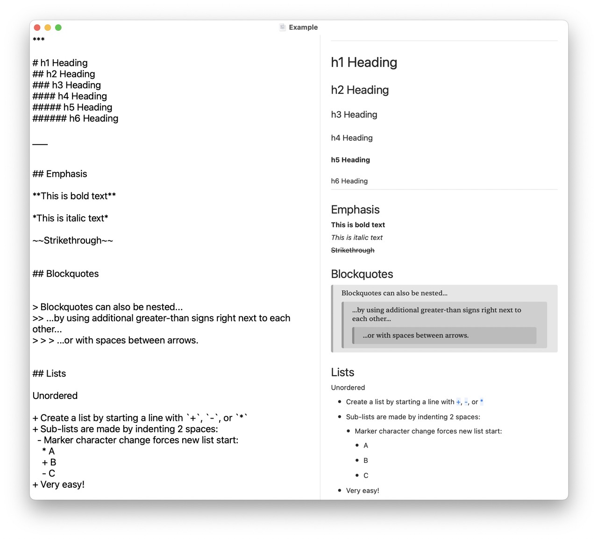

# MarkdownView

MarkdownView is a Swift Package for rendering Markdown text natively in SwiftUI.

Thanks to [apple/swift-markdown](https://github.com/apple/swift-markdown), it can fully compliant with the [CommonMark Spec](https://spec.commonmark.org/current/).

Here is a preview :)



## Supported Platforms

You can use MarkdownView in the following platforms:

* macOS 13.0+
* iOS 16.0+
* tvOS 16.0+

Sadly, the system requirements is relatively high because we need to use the Layout Protocal that only supports in the new Operating Systems to automatically position elements.  

If you still want to support older operating systems, there is a similar package[gonzalezreal/MarkdownUI](https://github.com/gonzalezreal/MarkdownUI.git).

## Advantage

- Fully compliant with CommonMark
- **SVG rendering** support
-  Highly **Customizable** and **Extensible**
    - Supports almost all the **built-in modifiers**
-  Fully Native SwiftUI code

## Usage

You can create a `Markdown` view by providing a Markdown-formatted string.

```swift
MarkdownView(text: "This is the Apple's **newly published** [swift-markdown](https://github.com/apple/swift-markdown)")
```


If your `Markdown` have CheckBoxes, you can provide a Binding string.

```swift
@State var text = "- [x] Buy some eggs"
```

```swift
MarkdownView(text: $text)
```   


## Swift Package Manager

In your `Package.swift` Swift Package Manager manifest, add the following dependency to your `dependencies` argument:

```swift
.package(url: "https://github.com/LiYanan2004/MarkdownView.git", .branch("main")),
```

Add the dependency to any targets you've declared in your manifest:

```swift
.target(name: "MyTarget", dependencies: ["MarkdownView"]),
```

## Similar Projects
- [MarkdownUI](https://github.com/gonzalezreal/MarkdownUI)

## Dependencies
- [apple/swift-markdown](https://github.com/apple/swift-markdown): Parse documents
- [SVGKit/SVGKit](https://github.com/SVGKit/SVGKit): Convert SVG to UIImage/NSImage
