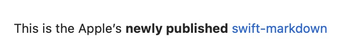

# MarkdownView

MarkdownView is a Swift Package for rendering Markdown text natively in SwiftUI.

Thanks to [apple/swift-markdown](https://github.com/apple/swift-markdown), it can fully compliant with the [CommonMark Spec](https://spec.commonmark.org/current/).

Here is a preview :)


> `MarkdownView` is still in beta. 
> There might have some API changes in the future.
> 
> Note: `MarkdownView` doesn’t support Tables on iOS 15, macOS 12 and tvOS 15. This capability will be added in the future.

## Supported Platforms

You can use MarkdownView in the following platforms:

* macOS 12.0+
* iOS 15.0+
* tvOS 15.0+

## Advantage

- Fully compliant with CommonMark
- **SVG rendering** support
-  Highly **Customizable** and **Extensible**
    - Supports almost all the **built-in modifiers**
    - Supports Directive Block Rendering
    - Supports custom image loading
-  Fully Native SwiftUI code

## Usage

You can create a `Markdown` view by providing a Markdown-formatted string.

```swift
MarkdownView(text: "This is the Apple's **newly published** [swift-markdown](https://github.com/apple/swift-markdown)")
```



If your `Markdown` have check boxes, you can provide a Binding string.

```swift
@State var text = """
- [x] Write the press release
- [ ] Update the website
- [ ] Contact the media
"""
```

```swift
MarkdownView(text: $text)
```   


> For more information, Check out [MarkdownView's Documentation](https://liyanan2004.github.io/MarkdownView/documentation/markdownview/)

## Add Custom Handlers

You can add your custom image handlers and block directive handlers to display your content.

To do that, first create your handler.

```swift
struct CustomImageHandler: ImageDisplayable {
    func makeImage(url: URL, alt: String?) -> some View {
        AsyncImage(url: url) {
            switch $0 {
            case .empty: ProgressView()
            case .success(let image): image.resizable()
            case .failure(let error): Text(error.localizedDescription)
            @unknown default: Text("Unknown situation")
            }
        }
    }
}
```

Then apply your handler to `MarkdownView`.

```swift
MarkdownView(text: markdownText)
    .imageHandler(CustomImageHandler(), forURLScheme: "my-image")
```

The implementation of the block directive is exactly the same way.

## Todos

- [ ] Table support for iOS 15.0, macOS 12.0 and tvOS 15.0.
- [ ] watchOS support. (specifically watchOS 7.0+)
- [ ] Add support for font size adjustments using SwiftUI built-in `.font(_:)` modifier.
- [ ] Built-in image handlers improvements.
- [ ] Add capability to override default image handlers.

## Swift Package Manager

In your `Package.swift` Swift Package Manager manifest, add the following dependency to your `dependencies` argument:

```swift
.package(url: "https://github.com/LiYanan2004/MarkdownView.git", .branch("main")),
```

Add the dependency to any targets you've declared in your manifest:

```swift
.target(name: "MyTarget", dependencies: ["MarkdownView"]),
```

## Similar Projects

- [MarkdownUI](https://github.com/gonzalezreal/MarkdownUI)

## Dependencies

- [apple/swift-markdown](https://github.com/apple/swift-markdown): Parse documents
- [SVGKit/SVGKit](https://github.com/SVGKit/SVGKit): Convert SVG to UIImage/NSImage
